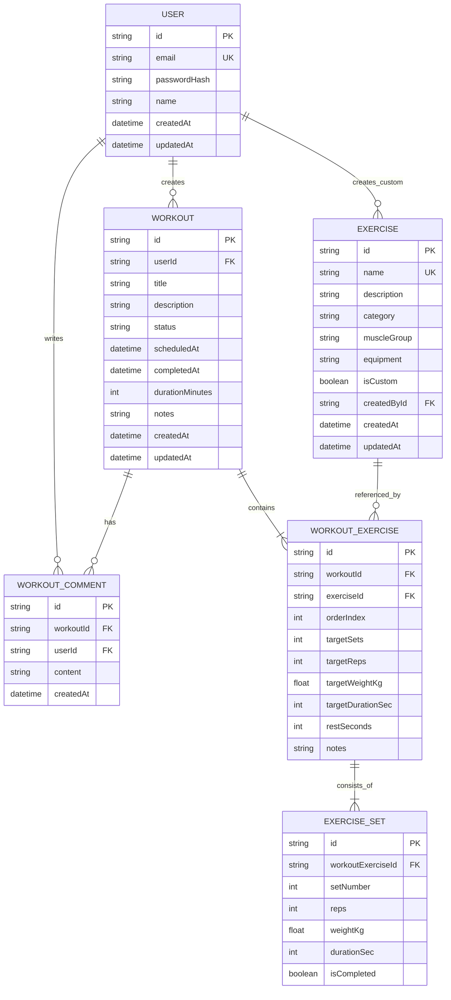

# Workout Tracker API

A production-grade RESTful backend API for a Workout Tracker application built with **Node.js**, **TypeScript**, **Express.js**, **Prisma ORM**, and **SQLite**. The system includes **JWT authentication**, **relational database modeling**, **data seeding**, **workout planning & scheduling**, **progress/volume analytics & reporting**, a **comprehensive unit & integration test suite (Vitest + Supertest)**, and **interactive OpenAPI 3.0 (Swagger) documentation**.

---

## Key Features

- **User Authentication & Authorization**:
  - Secure registration & login with password hashing via `bcryptjs` (salt rounds: 10).
  - Stateless JSON Web Tokens (JWT) bearer authentication.
  - Strict user data isolation (users only have access to their own workouts and custom exercises).
  - Profile retrieval & logout flow.

- **Exercise Catalog & Data Seeder**:
  - Pre-seeded database with 36+ popular standard exercises covering all major muscle groups and categories.
  - Categorization: `STRENGTH`, `CARDIO`, `FLEXIBILITY`, `HIIT`, `CALISTHENICS`.
  - Muscle Groups: `CHEST`, `BACK`, `LEGS`, `SHOULDERS`, `ARMS`, `CORE`, `FULL_BODY`.
  - Equipment: `BARBELL`, `DUMBBELL`, `MACHINE`, `BODYWEIGHT`, `CABLE`, `KETTLEBELL`, `OTHER`.
  - Filtering by category, muscle group, equipment, full-text search, and pagination.
  - Custom exercise creation for users.

- **Workout Management & Scheduling**:
  - Create workout plans composed of multiple exercises, with configurable target sets, target reps, target weight, duration, and rest intervals.
  - Schedule workouts for specific future dates and times (`scheduledAt`).
  - Manage workout lifecycle status: `SCHEDULED`, `IN_PROGRESS`, `COMPLETED`, `CANCELLED`.
  - Quick status updates (`PATCH /api/workouts/:id/status`) with automatic completion timestamp recording.
  - Full CRUD operations with cascade deletion for nested sets and comments.
  - Add workout comments and post-workout reflection notes.

- **Progress Tracking & Analytics Engine**:
  - **Summary Report (`/api/reports/summary`)**: Total workouts, completion rate, total volume in kg (`reps × weight`), total duration in minutes, sets, reps, active daily streak, and distribution breakdowns by category and muscle group.
  - **Exercise Progress (`/api/reports/exercise-progress/:exerciseId`)**: Historical performance tracking, session max weight, total volume per session, and estimated 1-Rep Max (1RM) using Epley's formula:
    $$\text{1RM} = \text{weight} \times \left(1 + \frac{\text{reps}}{30}\right)$$
  - **Volume Trends (`/api/reports/volume-trends`)**: Aggregate training volume and frequency trends grouped by day, week, or month.

- **OpenAPI 3.0 / Swagger Interactive Docs**:
  - Interactive UI hosted at `http://localhost:5000/api/docs`.
  - Raw JSON OpenAPI specification at `http://localhost:5000/api/docs.json`.

- **Robust Automated Test Suite**:
  - 37 unit and integration tests using Vitest and Supertest covering all endpoints, authentication, validation errors, edge cases, and user isolation.

---

## Architecture & Database Schema

### Entity-Relationship Diagram



---

## Quick Start

### 1. Prerequisites
- **Node.js** (v18 or v24+ recommended)
- **npm** (v9+)

### 2. Installation
```bash
# Clone or navigate to the project repository
cd "Workout Tracker"

# Install all dependencies
npm install
```

### 3. Environment Configuration
Create a `.env` file from `.env.example`:
```env
PORT=5000
NODE_ENV=development
DATABASE_URL="file:./dev.db"
JWT_SECRET="super-secret-workout-tracker-jwt-key-change-in-production-12345"
JWT_EXPIRES_IN="7d"
CORS_ORIGIN="*"
```

### 4. Database Setup & Seeding
```bash
# Push schema to SQLite database and generate Prisma Client
npm run prisma:push

# Seed standard exercises into the database
npm run seed
```

### 5. Running the Application
```bash
# Start development server with auto-reload
npm run dev

# Or build and start production server
npm run build
npm start
```

Server will be running at `http://localhost:5000`.

---

## Running Tests

Execute the automated test suite with Vitest:
```bash
npm run test
```

---

## API Endpoints Reference

### Authentication (`/api/auth`)

| Method | Endpoint | Description | Auth Required |
|---|---|---|---|
| `POST` | `/api/auth/signup` | Register new user account | No |
| `POST` | `/api/auth/login` | Authenticate user & get JWT token | No |
| `POST` | `/api/auth/logout` | Client logout confirmation | No |
| `GET` | `/api/auth/me` | Get current user profile | Yes (Bearer) |

#### Example: Signup
```bash
curl -X POST http://localhost:5000/api/auth/signup \
  -H "Content-Type: application/json" \
  -d '{
    "email": "alex@example.com",
    "password": "SecurePassword123!",
    "name": "Alex Smith"
  }'
```

#### Example: Login
```bash
curl -X POST http://localhost:5000/api/auth/login \
  -H "Content-Type: application/json" \
  -d '{
    "email": "alex@example.com",
    "password": "SecurePassword123!"
  }'
```

---

### Exercises (`/api/exercises`)

| Method | Endpoint | Description | Auth Required |
|---|---|---|---|
| `GET` | `/api/exercises` | List exercises with filters (`category`, `muscleGroup`, `search`, `page`, `limit`) | Optional |
| `GET` | `/api/exercises/:id` | Get exercise details by UUID | No |
| `POST` | `/api/exercises` | Create a custom exercise | Yes (Bearer) |

#### Example: List Chest Exercises
```bash
curl -X GET "http://localhost:5000/api/exercises?muscleGroup=CHEST"
```

#### Example: Create Custom Exercise
```bash
curl -X POST http://localhost:5000/api/exercises \
  -H "Content-Type: application/json" \
  -H "Authorization: Bearer <YOUR_JWT_TOKEN>" \
  -d '{
    "name": "Incline Hex Press",
    "description": "Dumbbell press keeping dumbbells pressed together to emphasize inner chest.",
    "category": "STRENGTH",
    "muscleGroup": "CHEST",
    "equipment": "DUMBBELL"
  }'
```

---

### Workout Plans & Scheduling (`/api/workouts`)

| Method | Endpoint | Description | Auth Required |
|---|---|---|---|
| `POST` | `/api/workouts` | Create workout plan with scheduled date, nested exercises & sets | Yes (Bearer) |
| `GET` | `/api/workouts` | List workouts (filter by `status`, `view`, `from`, `to`, `sort`, `page`) | Yes (Bearer) |
| `GET` | `/api/workouts/:id` | Get full workout details (exercises, sets, comments) | Yes (Bearer) |
| `PUT` | `/api/workouts/:id` | Update workout details, exercises, or sets | Yes (Bearer) |
| `PATCH` | `/api/workouts/:id/status` | Quick update workout status (`SCHEDULED`, `IN_PROGRESS`, `COMPLETED`, `CANCELLED`) | Yes (Bearer) |
| `DELETE` | `/api/workouts/:id` | Delete workout plan | Yes (Bearer) |
| `POST` | `/api/workouts/:id/comments` | Add comment / feedback note to workout | Yes (Bearer) |
| `GET` | `/api/workouts/:id/comments` | Get comments for workout | Yes (Bearer) |

#### Example: Create & Schedule a Workout
```bash
curl -X POST http://localhost:5000/api/workouts \
  -H "Content-Type: application/json" \
  -H "Authorization: Bearer <YOUR_JWT_TOKEN>" \
  -d '{
    "title": "Push Day - Chest & Shoulders",
    "description": "Focusing on heavy bench and strict shoulder press",
    "scheduledAt": "2026-08-20T09:00:00.000Z",
    "status": "SCHEDULED",
    "durationMinutes": 60,
    "notes": "Target 85kg on bench press",
    "exercises": [
      {
        "exerciseId": "<EXERCISE_UUID_BENCH_PRESS>",
        "orderIndex": 0,
        "targetSets": 3,
        "targetReps": 8,
        "targetWeightKg": 85,
        "restSeconds": 120,
        "sets": [
          { "setNumber": 1, "reps": 8, "weightKg": 85, "isCompleted": true },
          { "setNumber": 2, "reps": 8, "weightKg": 85, "isCompleted": true },
          { "setNumber": 3, "reps": 7, "weightKg": 85, "isCompleted": true }
        ]
      }
    ]
  }'
```

#### Example: Mark Workout as Completed
```bash
curl -X PATCH http://localhost:5000/api/workouts/<WORKOUT_UUID>/status \
  -H "Content-Type: application/json" \
  -H "Authorization: Bearer <YOUR_JWT_TOKEN>" \
  -d '{
    "status": "COMPLETED",
    "durationMinutes": 65
  }'
```

---

### Reports & Analytics (`/api/reports`)

| Method | Endpoint | Description | Auth Required |
|---|---|---|---|
| `GET` | `/api/reports/summary` | Aggregated workout count, volume, duration, streak, and distributions | Yes (Bearer) |
| `GET` | `/api/reports/exercise-progress/:exerciseId` | Exercise history, max weight, volume, and estimated 1-Rep Max | Yes (Bearer) |
| `GET` | `/api/reports/volume-trends` | Volume and frequency trends grouped by interval (`day`, `week`, `month`) | Yes (Bearer) |

#### Example: Get Summary Report
```bash
curl -X GET http://localhost:5000/api/reports/summary \
  -H "Authorization: Bearer <YOUR_JWT_TOKEN>"
```

*Example Response:*
```json
{
  "success": true,
  "data": {
    "overview": {
      "totalWorkouts": 12,
      "completedWorkouts": 10,
      "scheduledWorkouts": 2,
      "inProgressWorkouts": 0,
      "cancelledWorkouts": 0,
      "completionRatePercentage": 83.3,
      "totalVolumeKg": 24850.5,
      "totalDurationMinutes": 620,
      "totalSets": 96,
      "totalReps": 780,
      "activeStreakDays": 3
    },
    "distributions": {
      "byCategory": {
        "STRENGTH": 8,
        "CARDIO": 2,
        "HIIT": 2
      },
      "byMuscleGroup": {
        "CHEST": 12,
        "BACK": 10,
        "LEGS": 8,
        "SHOULDERS": 6,
        "ARMS": 4
      }
    }
  }
}
```

---

## Interactive OpenAPI Documentation

The API includes full interactive Swagger documentation. Once the server is running, visit:
- **Swagger UI**: [`http://localhost:5000/api/docs`](http://localhost:5000/api/docs)
- **OpenAPI 3.0 JSON**: [`http://localhost:5000/api/docs.json`](http://localhost:5000/api/docs.json)

---

## Security & Quality Best Practices

1. **Password Hashing**: `bcryptjs` with salt round factor 10 ensures brute-force resistance.
2. **Stateless JWT Tokens**: Tokens signed with HS256 algorithm and configured with configurable expiration.
3. **Data Isolation**: Database queries enforce user ownership on every mutating and query endpoint.
4. **Input Sanitization**: Request bodies, route parameters, and query parameters validated with strict Zod schemas.
5. **Relational Constraints & Cascading**: Foreign keys and relational integrity modeled with Prisma ORM.
6. **Robust Error Handling**: Centralized Express middleware catching custom `ApiError`, Zod validation errors, Prisma constraint violations, and unhandled errors.
